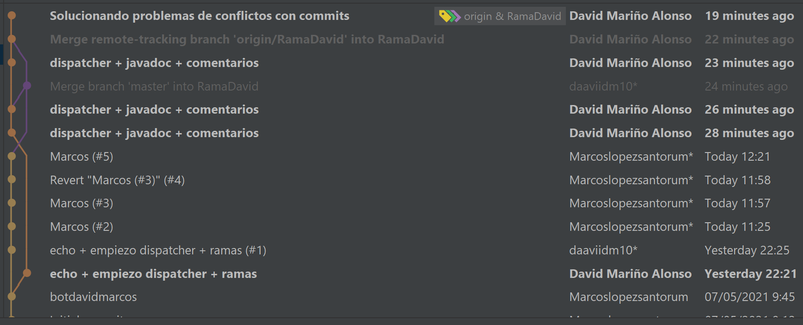
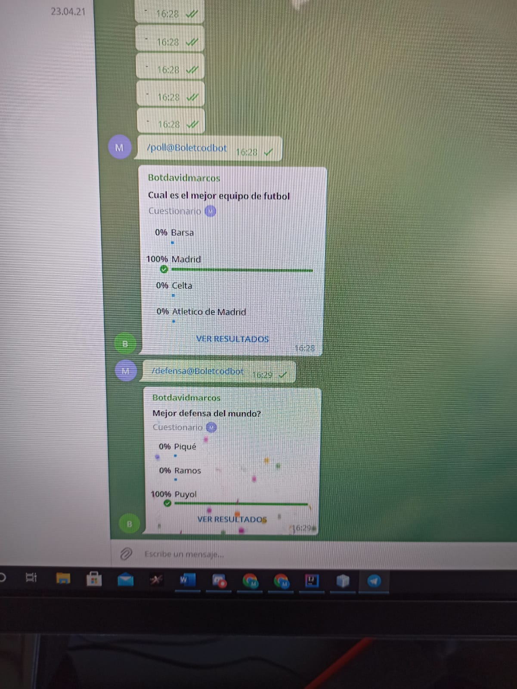
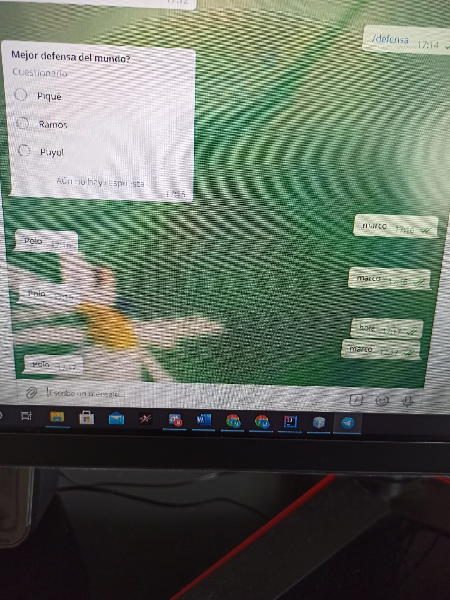
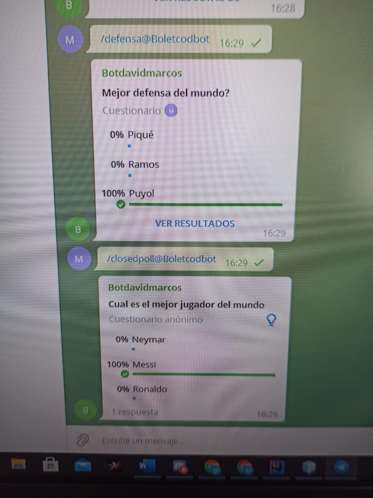
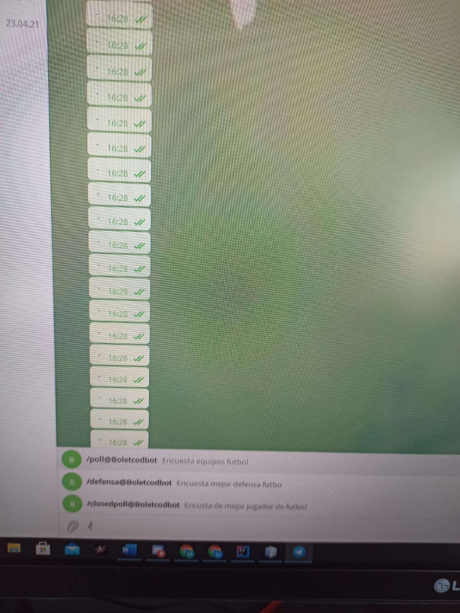

# BootTelegram

# Autores

## Marcos López Santorum

## David Mariño Alonso
  
  
  
  
  
  
 
  
  
  
  
  
  
  
  
  
  
  
  
  

## Inicio

## Dispatcher 

### Echo es el primer comando que utilizamos para que se active el bot

            command("start") {

                val result = bot.sendMessage(chatId = ChatId.fromId(message.chat.id), text = "El bot se ha iniciado")

                result.fold({

                }, {

                })
            }
            
            

### Polls son los comandos que introducimos para que despues los haga el bot 

            command("poll") {
                bot.sendPoll(
                    chatId = ChatId.fromId(message.chat.id),
                    type = QUIZ,
                    question = "Cual es el mejor equipo de futbol",
                    options = listOf("Barsa", "Madrid", "Celta","Atletico de Madrid"),
                    correctOptionId = 1,
                    isAnonymous = false,
                    openPeriod = 120,
                )
            }
    
    
    
    
    

    ### Webhook lo intentamos pero nos daba error al importar
    
    
  
